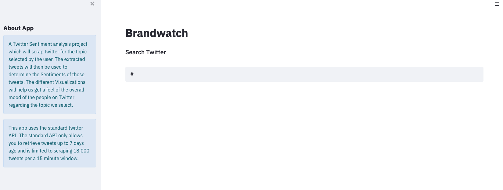
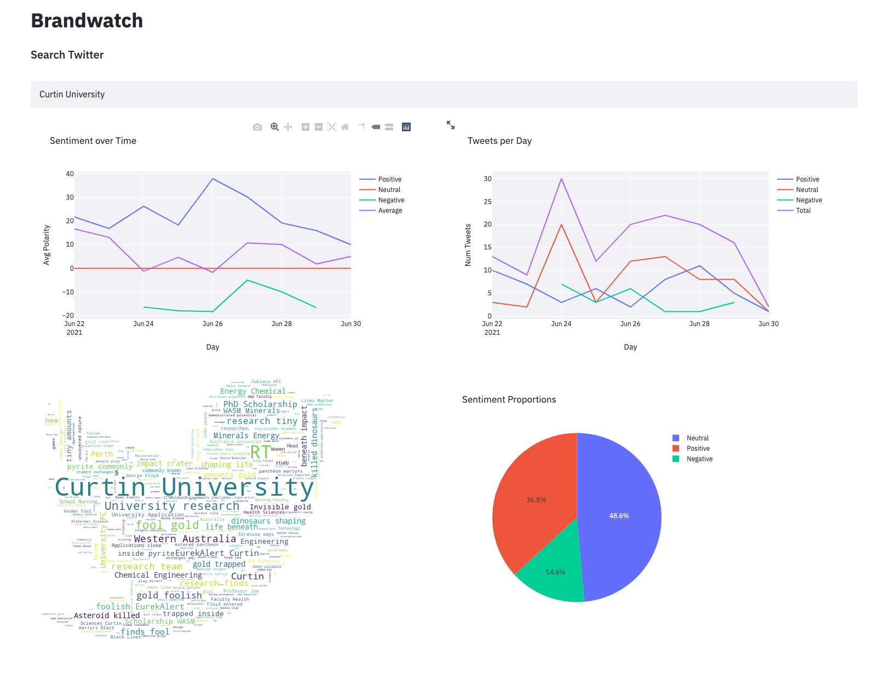

# Brand Analytics (for beginners)
Marketing Anlaytics

Monitoring audience behaviour on social media has so many benefits. For
instance, it can help you identify what your target audience likes, what
their preferences are, and what they might be interested in hearing more
about. It can also show you who your competitors are and how well they are
doing compared to you.

This app uses the standard twitter API. The standard API only allows you
to retrieve tweets up to 7 days ago and is limited to scraping 18,000 tweets
per a 15 minute window.

A Twitter Sentiment analysis project which will scrap twitter for the topic
selected by the user. The extracted tweets will then be used to determine
the Sentiments of those tweets. The different Visualizations will help us
get a feel of the overall mood of the people on Twitter.

## [Try Brandwatch](https://share.streamlit.io/michaelborck/brandwatch/main/app.py)

## Step 1: Type in search term

## Step: See the trend

