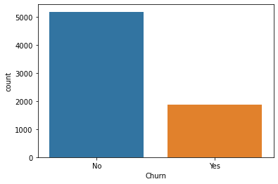
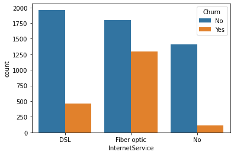
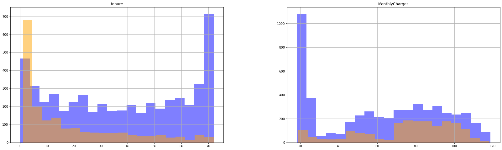

# Data Understanding

Stage 2

## [Telco Customer Churn](https://www.kaggle.com/blastchar/telco-customer-churn)

The data set includes information about:

* Customers who left within the last month – the column is called Churn
* Services that each customer has signed up for – phone, multiple lines,
  internet, online security, online backup, device protection, tech support,
  and streaming TV and movies
* Customer account information – how long they’ve been a customer, contract,
  payment method, paperless billing, monthly charges, and total charges
* Demographic info about customers – gender, age range, and if they have
  partners and dependents

Each row represents a customer, each column contains customer’s attributes
described on the column Metadata.

See [Telco Customer Churn](https://www.kaggle.com/blastchar/telco-customer-churn)
for more information on the data and other notebooks.

## Churn Count

## Based on gender

## Bsaed on service

From the two charts above, I can clearly see that there is some discrimination in the data. The monthly charges chart (on the left) shows that most of the loyal customers that stayed with the company had a monthly charge between $20 and $30. Most of the customers that churned had a monthly charge of $70 to $100. Maybe the company should lower the monthly charges to retain customers.

The tenure chart (on the right) shows some discrimination as well. From the chart, I can see that most of the customers that churned had between 1 and 9 months with the company, while most of the retained customers had a tenure between 24 and 72 months which is 2 to 6 years. So, it may be in the companies best interest to try everything they can to keep their customers for at least 2 years.

## Verify data quality

Examine the quality of the data, addressing questions such as:

* Is the data complete (does it cover all the cases required)?
* Do the data type make sense?
* Is it correct, or does it contain errors and, if there are errors, how common are they?
* Are there missing values in the data? If so, how are they represented, where do they occur, and how common are they?
* * How many unique values are in the data set?
* Are there duplicate values?

<table border="1" class="dataframe">
  <thead>
    <tr style="text-align: right;">
      <th></th>
      <th>Data Type</th>
      <th>Missing Values</th>
      <th>Unique Values</th>
      <th>Maximum Value</th>
    </tr>
  </thead>
  <tbody>
    <tr>
      <th>customerID</th>
      <td>object</td>
      <td>0</td>
      <td>7043</td>
      <td>9995-HOTOH</td>
    </tr>
    <tr>
      <th>gender</th>
      <td>object</td>
      <td>0</td>
      <td>2</td>
      <td>Male</td>
    </tr>
    <tr>
      <th>SeniorCitizen</th>
      <td>int64</td>
      <td>0</td>
      <td>2</td>
      <td>1</td>
    </tr>
    <tr>
      <th>Partner</th>
      <td>object</td>
      <td>0</td>
      <td>2</td>
      <td>Yes</td>
    </tr>
    <tr>
      <th>Dependents</th>
      <td>object</td>
      <td>0</td>
      <td>2</td>
      <td>Yes</td>
    </tr>
    <tr>
      <th>tenure</th>
      <td>int64</td>
      <td>0</td>
      <td>73</td>
      <td>72</td>
    </tr>
    <tr>
      <th>PhoneService</th>
      <td>object</td>
      <td>0</td>
      <td>2</td>
      <td>Yes</td>
    </tr>
    <tr>
      <th>MultipleLines</th>
      <td>object</td>
      <td>0</td>
      <td>3</td>
      <td>Yes</td>
    </tr>
    <tr>
      <th>InternetService</th>
      <td>object</td>
      <td>0</td>
      <td>3</td>
      <td>No</td>
    </tr>
    <tr>
      <th>OnlineSecurity</th>
      <td>object</td>
      <td>0</td>
      <td>3</td>
      <td>Yes</td>
    </tr>
    <tr>
      <th>OnlineBackup</th>
      <td>object</td>
      <td>0</td>
      <td>3</td>
      <td>Yes</td>
    </tr>
    <tr>
      <th>DeviceProtection</th>
      <td>object</td>
      <td>0</td>
      <td>3</td>
      <td>Yes</td>
    </tr>
    <tr>
      <th>TechSupport</th>
      <td>object</td>
      <td>0</td>
      <td>3</td>
      <td>Yes</td>
    </tr>
    <tr>
      <th>StreamingTV</th>
      <td>object</td>
      <td>0</td>
      <td>3</td>
      <td>Yes</td>
    </tr>
    <tr>
      <th>StreamingMovies</th>
      <td>object</td>
      <td>0</td>
      <td>3</td>
      <td>Yes</td>
    </tr>
    <tr>
      <th>Contract</th>
      <td>object</td>
      <td>0</td>
      <td>3</td>
      <td>Two year</td>
    </tr>
    <tr>
      <th>PaperlessBilling</th>
      <td>object</td>
      <td>0</td>
      <td>2</td>
      <td>Yes</td>
    </tr>
    <tr>
      <th>PaymentMethod</th>
      <td>object</td>
      <td>0</td>
      <td>4</td>
      <td>Mailed check</td>
    </tr>
    <tr>
      <th>MonthlyCharges</th>
      <td>float64</td>
      <td>0</td>
      <td>1585</td>
      <td>118.75</td>
    </tr>
    <tr>
      <th>TotalCharges</th>
      <td>object</td>
      <td>0</td>
      <td>6531</td>
      <td>999.9</td>
    </tr>
    <tr>
      <th>Churn</th>
      <td>object</td>
      <td>0</td>
      <td>2</td>
      <td>Yes</td>
    </tr>
  </tbody>
</table>

