# Evaluation

Stage 5

Evaluation learning models use a feedback process to learn about how
accurate it is. They do this by comparing their predicted value with the
actual value and then adjusting their prediction based on what they have
learned so far. This feedback process allows evaluation learning models
to be more accurate than other machine learning algorithms because they can be updated with new information.

## Learning

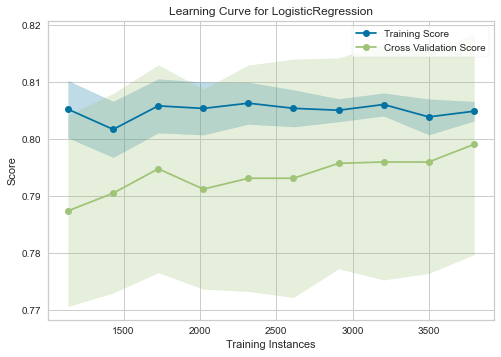

## Features

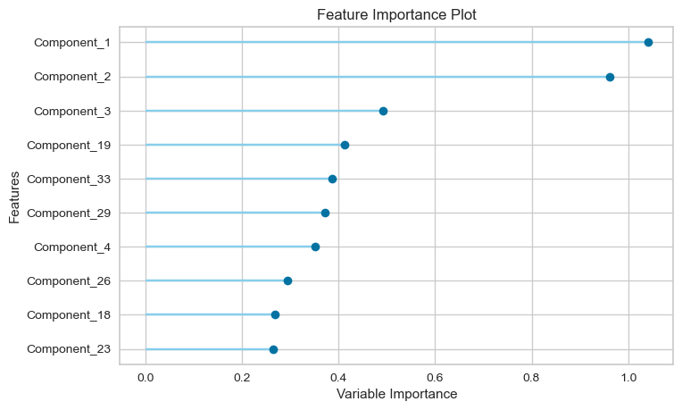

## Confusion Matrix

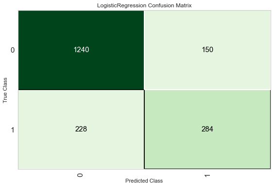

## Class Report

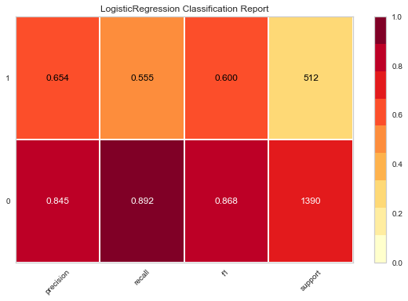

## Errors

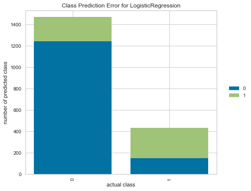

## AUC/ROC

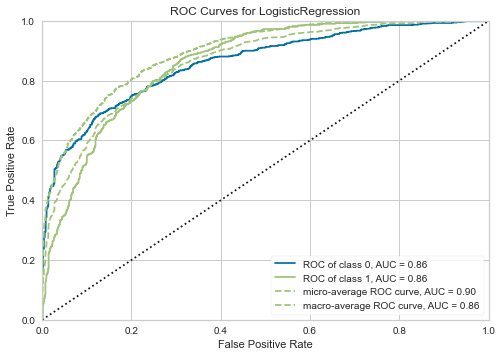

## Validation Curve

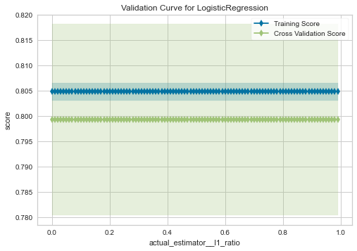

## Precision/Recall

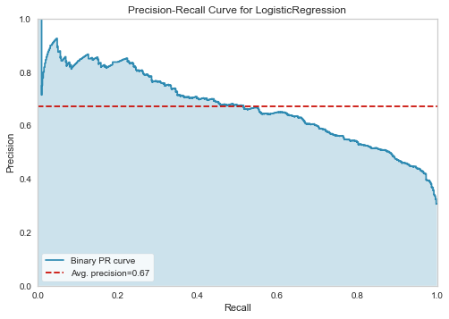

## Calibration

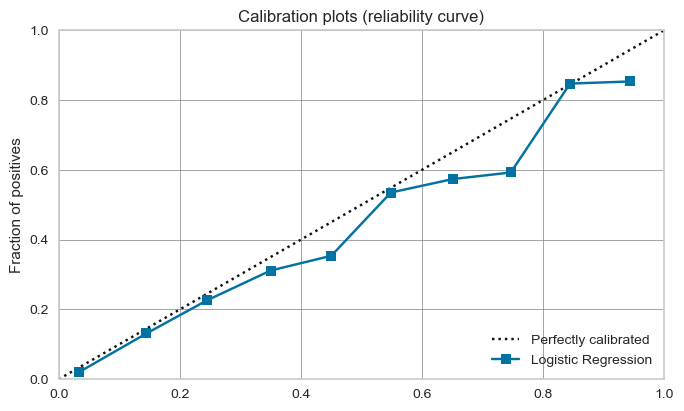

## Boundary

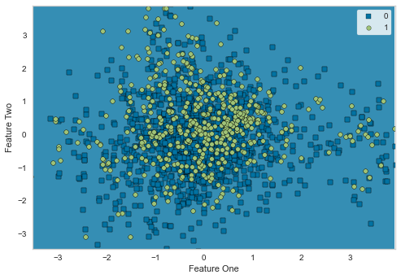

## Threshold

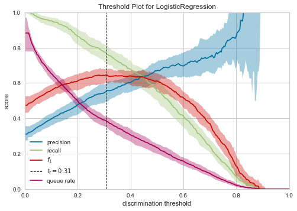

## Dimension

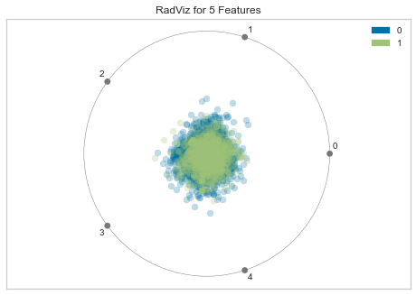

## Recursive Feature Selection

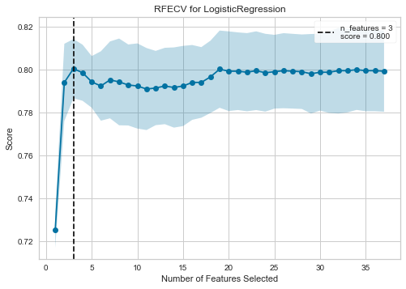

