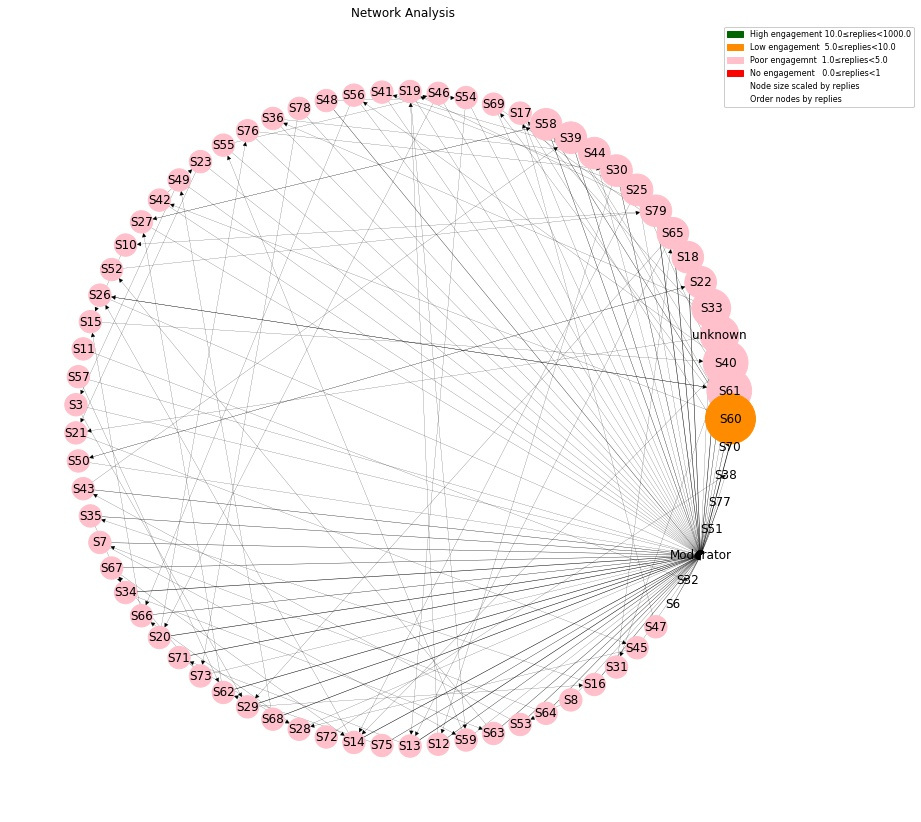
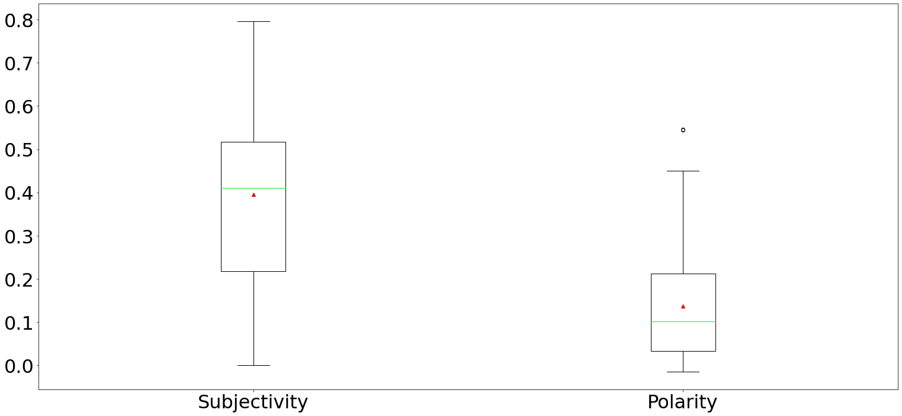
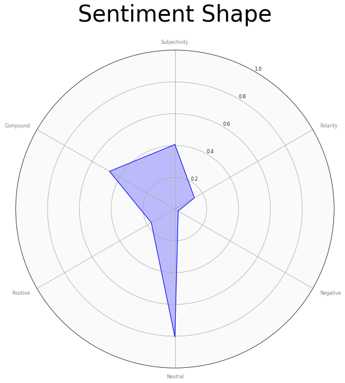

# Discussion Board Analysis

Learning Analytics

The world is changing. Communication is moving to digital boards, and
communities are coalescing around these boards.  They have also become a
common interactive tool in the learning and teaching environment.

Discussion Boards are an interesting place to examine how people interact
with each other online using different strategies that may be best suited
to their personality or position on a topic. With this notebook, you can
easily visualize and understand the interaction and mood of the discussion.

## Work Flow

1. (External) Export Blackboard course to local folder, ensure uncompressed.
2. Extract posts form the blackboard course
3. Clean posts
4. Plot interaction between students (eyeball plot)
5. (Not shown) Calculate Word frequencies and Word Clouds
6. (Not shown) Summarize Author Posting frequency
7. Calculate Polarity, Subjective, Negative, Neutral, Positive, and Compound
8. Create Polarity and Subjectivity Box Plots
9. Use sentinment dimension to plot the 'Shape'

<table border="1" class="dataframe">
  <thead>
    <tr style="text-align: right;">
      <th></th>
      <th>Subjectivity</th>
      <th>Polarity</th>
      <th>Negative</th>
      <th>Neutral</th>
      <th>Positive</th>
      <th>Compound</th>
    </tr>
    <tr>
      <th>author</th>
      <th></th>
      <th></th>
      <th></th>
      <th></th>
      <th></th>
      <th></th>
    </tr>
  </thead>
  <tbody>
    <tr>
      <th>0</th>
      <td>0.182000</td>
      <td>0.068000</td>
      <td>0.029000</td>
      <td>0.901500</td>
      <td>0.069500</td>
      <td>0.220200</td>
    </tr>
    <tr>
      <th>1</th>
      <td>0.279583</td>
      <td>0.061736</td>
      <td>0.000000</td>
      <td>0.920000</td>
      <td>0.080000</td>
      <td>0.485100</td>
    </tr>
    <tr>
      <th>2</th>
      <td>0.490774</td>
      <td>0.261210</td>
      <td>0.000000</td>
      <td>0.747667</td>
      <td>0.252333</td>
      <td>0.678867</td>
    </tr>
    <tr>
      <th>3</th>
      <td>0.795795</td>
      <td>0.045808</td>
      <td>0.035000</td>
      <td>0.656000</td>
      <td>0.308500</td>
      <td>0.894850</td>
    </tr>
    <tr>
      <th>4</th>
      <td>0.646389</td>
      <td>0.252500</td>
      <td>0.024667</td>
      <td>0.669667</td>
      <td>0.306000</td>
      <td>0.645167</td>
    </tr>
    <tr>
      <th>...</th>
      <td>...</td>
      <td>...</td>
      <td>...</td>
      <td>...</td>
      <td>...</td>
      <td>...</td>
    </tr>
    <tr>
      <th>65</th>
      <td>0.431597</td>
      <td>0.059028</td>
      <td>0.000000</td>
      <td>0.837500</td>
      <td>0.162500</td>
      <td>0.614950</td>
    </tr>
    <tr>
      <th>66</th>
      <td>0.490476</td>
      <td>0.213095</td>
      <td>0.021000</td>
      <td>0.696500</td>
      <td>0.283000</td>
      <td>0.711900</td>
    </tr>
    <tr>
      <th>67</th>
      <td>0.450000</td>
      <td>0.281250</td>
      <td>0.000000</td>
      <td>0.888000</td>
      <td>0.112000</td>
      <td>0.490300</td>
    </tr>
    <tr>
      <th>68</th>
      <td>0.213636</td>
      <td>0.059091</td>
      <td>0.000000</td>
      <td>0.881500</td>
      <td>0.118500</td>
      <td>0.473850</td>
    </tr>
    <tr>
      <th>69</th>
      <td>0.231888</td>
      <td>0.156378</td>
      <td>0.039500</td>
      <td>0.756000</td>
      <td>0.204000</td>
      <td>0.594050</td>
    </tr>
  </tbody>
</table>

70 rows × 6 columns

The polarity is a float between -1 and 1, where -1 is a negative statement and 1 is a positive statement. From the above, we can see the IMDB statement is deemed as negative, but not heavily so, and the Twitter statement is very positive.
The subjectivity is TextBlobs score of whether the statement is deemed as more opinion, or fact based. A higher subjectivity score means it is less objective, and therefore would be highly opinionated.

