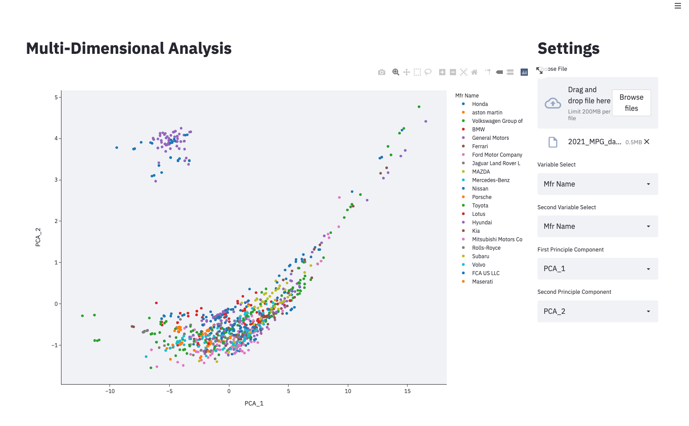

# Automated PCA Analysis

PCA is a technique for transforming a set of variables into a set of
uncorrelated variables. PCA can be used for exploratory data analysis,
dimensionality reduction, feature extraction, and many other tasks. PCA is a
linear transformation so it can be implemented efficiently and it’s the most
commonly used algorithm for dimensionality reduction.

This web app tool allows you to upload a CSV and then plot two components,
automating the building of PCA plots.

## Waiting for CSV file

## Automated Plot

