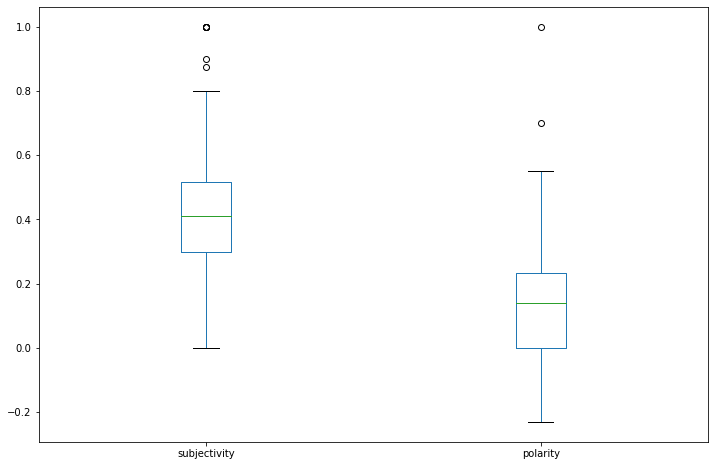

# Sentiment Analysis using Textblob (NLP for beginners)
Text Analytics

## Workflow
1. Load & Clean data
2. Install TextBlob (Optional)
3. Perform sentiment analysis

## 1. Load & Clean data


```python
import pandas as pd
import re

# Could use text cleaner (lighweigtht) or nltk and remove stopwords etc..
def clean_text(text):
    # Comment out any line for textual elements you want to keep
    text = re.sub('<[^<]+?>', '', text)  # strip html
    text = re.sub('\\xa0','', text)      # remove some rogue code from posts
    text = re.sub(r'[^\w\s]','',text)    # remove puncuation
    text = re.sub(r'\d+', '', text)      # remove numbers
    text = " ".join(text.split())        # remove extra whitespace
    text = text.lower()                  # to lowercase
    return text

# Load the data
df = pd.read_csv('posts.csv')
print("Before Cleaning")
display(df.head())

# Clean the data
df.post = df.post.apply(clean_text)
print("After Cleaning")
df.head()
```

    Before Cleaning


<div>
<style scoped>
    .dataframe tbody tr th:only-of-type {
        vertical-align: middle;
    }

    .dataframe tbody tr th {
        vertical-align: top;
    }

    .dataframe thead th {
        text-align: right;
    }
</style>
<table border="1" class="dataframe">
  <thead>
    <tr style="text-align: right;">
      <th></th>
      <th>post</th>
    </tr>
  </thead>
  <tbody>
    <tr>
      <th>0</th>
      <td>&lt;p&gt;Are there any key differences in the procur...</td>
    </tr>
    <tr>
      <th>1</th>
      <td>&lt;p&gt;The concept of procurement is considerably ...</td>
    </tr>
    <tr>
      <th>2</th>
      <td>&lt;p&gt;What are the roles and responsibilities of ...</td>
    </tr>
    <tr>
      <th>3</th>
      <td>&lt;p&gt;The Chief Procurement Officer is head of th...</td>
    </tr>
    <tr>
      <th>4</th>
      <td>&lt;p&gt;How does governance play part in the ICT pr...</td>
    </tr>
  </tbody>
</table>
</div>


    After Cleaning


<div>
<style scoped>
    .dataframe tbody tr th:only-of-type {
        vertical-align: middle;
    }

    .dataframe tbody tr th {
        vertical-align: top;
    }

    .dataframe thead th {
        text-align: right;
    }
</style>
<table border="1" class="dataframe">
  <thead>
    <tr style="text-align: right;">
      <th></th>
      <th>post</th>
    </tr>
  </thead>
  <tbody>
    <tr>
      <th>0</th>
      <td>are there any key differences in the procureme...</td>
    </tr>
    <tr>
      <th>1</th>
      <td>the concept of procurement is considerably sim...</td>
    </tr>
    <tr>
      <th>2</th>
      <td>what are the roles and responsibilities of a c...</td>
    </tr>
    <tr>
      <th>3</th>
      <td>the chief procurement officer is head of the p...</td>
    </tr>
    <tr>
      <th>4</th>
      <td>how does governance play part in the ict procu...</td>
    </tr>
  </tbody>
</table>
</div>


## 2. Install TextBlob (Optional)

If not installed, uncomment preferred method below.  See https://jakevdp.github.io/blog/2017/12/05/installing-python-packages-from-jupyter/ for why using sys method


```python
# Install a conda package in the current Jupyter kernel
#import sys
#!conda install --yes --prefix {sys.prefix} textblob
```


```python
# Install a pip package in the current Jupyter kernel
#import sys
#!{sys.executable} -m pip install textblob
```

## 3. Perform Sentiment Analysis
The sentiment function of textblob returns two properties, polarity, and subjectivity.

### Polarity
Polarity is float which lies in the range of [-1,1] where 1 means positive statement and -1 means a negative statement.

### Subjectivity
Subjective sentences generally refer to personal opinion, emotion or judgment whereas objective refers to factual information. Subjectivity is also a float which lies in the range of [0,1].


```python
from textblob import TextBlob

# Wrapper so can use Pandas apply() function on a column
def getSubjectivity(text):
    return TextBlob(text).sentiment.subjectivity

def getPolarity(text):
    return TextBlob(text).sentiment.polarity

# Could use lambda function and not need wrappers above, but I think the wrapper
# method is more readable and matches the applicaiton of the clean_text() function above
# df['subjectivity'] = df.post.apply(lambda x: TextBlob(x).sentiment.subjectivity)

# Calculate sentiment,
df['subjectivity'] = df.post.apply(getSubjectivity)
df['polarity'] = df.post.apply(getPolarity)

df.head()
```


<div>
<style scoped>
    .dataframe tbody tr th:only-of-type {
        vertical-align: middle;
    }

    .dataframe tbody tr th {
        vertical-align: top;
    }

    .dataframe thead th {
        text-align: right;
    }
</style>
<table border="1" class="dataframe">
  <thead>
    <tr style="text-align: right;">
      <th></th>
      <th>post</th>
      <th>subjectivity</th>
      <th>polarity</th>
    </tr>
  </thead>
  <tbody>
    <tr>
      <th>0</th>
      <td>are there any key differences in the procureme...</td>
      <td>0.800000</td>
      <td>0.000000</td>
    </tr>
    <tr>
      <th>1</th>
      <td>the concept of procurement is considerably sim...</td>
      <td>0.358333</td>
      <td>0.163542</td>
    </tr>
    <tr>
      <th>2</th>
      <td>what are the roles and responsibilities of a c...</td>
      <td>0.000000</td>
      <td>0.000000</td>
    </tr>
    <tr>
      <th>3</th>
      <td>the chief procurement officer is head of the p...</td>
      <td>0.587963</td>
      <td>0.377778</td>
    </tr>
    <tr>
      <th>4</th>
      <td>how does governance play part in the ict procu...</td>
      <td>0.000000</td>
      <td>0.000000</td>
    </tr>
  </tbody>
</table>
</div>


```python
df.boxplot(column=['subjectivity','polarity'], grid=False, figsize=(12,8))
```


    <AxesSubplot:>





```python

```
