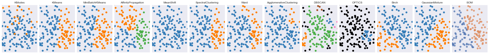
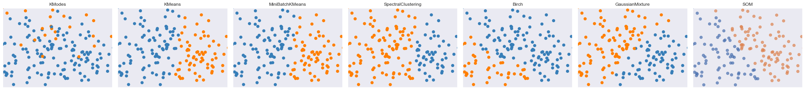
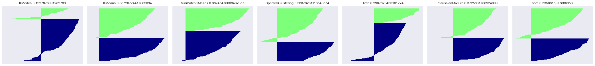
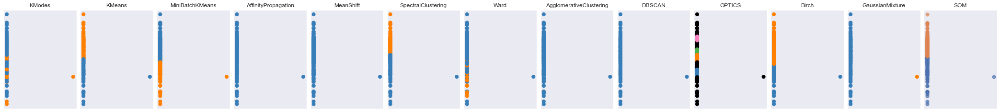
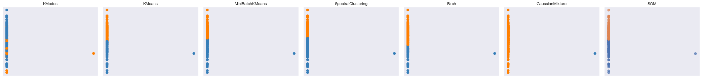
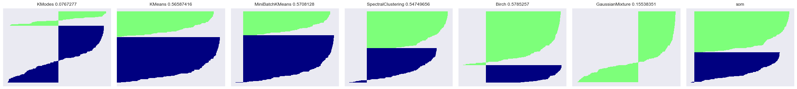
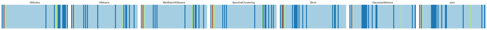

# Visual Decision Making

-

People who make decisions need to know what information is relevant and what
is not. Plotting your data can help you spot patterns and trends that you
might not otherwise notice, and help you make better decisions.

Clustering is an unsupervised learning strategy.  Because there is no
ground truth, checking the quality of clustering can be challenging.  These
plots are *not* for detailed analysis, they are used to
**visually select models** and can be used a point of discussion. So no
axis tick marks, legends or other distracting elements.

## Projection into PCA space

The survey data has one-hot-encoded and projected into PCA space.  The transformation into PCA is good
when the first two components are plotted against each other randomly fill the plot.
Let us plot the two most significant principal components (PC) and colour each by the cluster.

If the PCs are right, we should see a reasonable separation of the clusters. 'Black' means noise.

Based on the initial scatter plots, let us plot the potential models.

This plot is called the 'Silhouette' plot and is a visual way to interpret the validation and consistency
within clusters of data. Each group has its colour.  Generally, we want the clusters to be balanced, and
roughly the same size, but small clusters can sometimes identify outlier or interesting cluster that needs
further investigation. Any 'tails' to the left suggest a poor match of some data to the cluster (outliers?)
so we want these to be small

I call the following plot the 'barcode' plot (my name, not official).  I take the labels (cluster ids)
and map them back to the original survey data.  Then for each cluster, I calculate the 'mode' of each
question. The mode represents the average answers of each question for each cluster. Since each question
has an integer encoding, I assign each a colour. So visually, we can compare the average answers of each
group. So in this plot, you are looking for 'difference' to the band above

## Projection into AE space

Survey data has been projected into Autoencode (AE) space.
Let us plot the first two most compoments and colour each by the cluster.

If the AE is good, we should see reasonable seperation of the clusters. 'Black' mean noise

Based on the initial scatter plots, let us plot the potential models.

This plot is called the 'Silhouette' plot and is a visual way to interpret the validation and consistency
within clusters of data. Each group has its colour.  Generally, we want the clusters to be balanced, and
roughly the same size, but small clusters can sometimes identify outlier or interesting cluster that needs
further investigation. Any 'tails' to the left suggest a poor match of some data to the cluster (outliers?)
so we want these to be small

I call the following plot the 'barcode' plot (my name, not official).  I take the labels (cluster ids)
and map them back to the original survey data.  Then for each cluster, I calculate the 'mode' of each
question. The mode represents the average answers of each question for each cluster. Since each question
has an integer encoding, I assign each a colour. So visually, we can compare the average answers of each
group. So in this plot, you are looking for 'difference' to the band above

